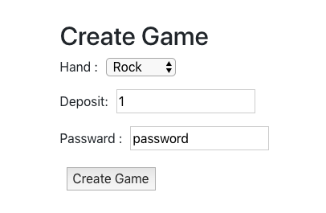
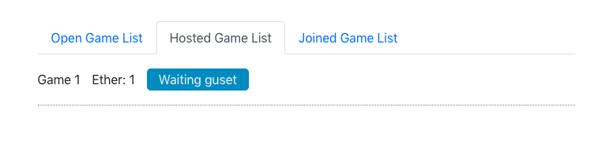
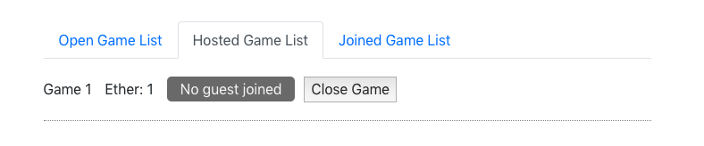
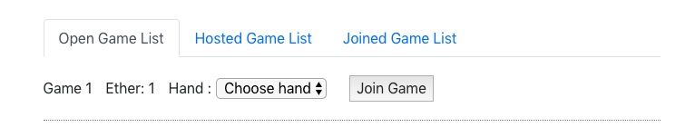
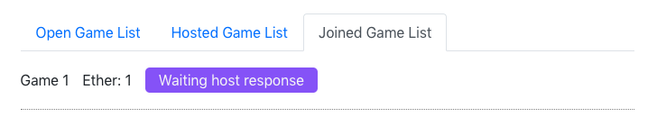
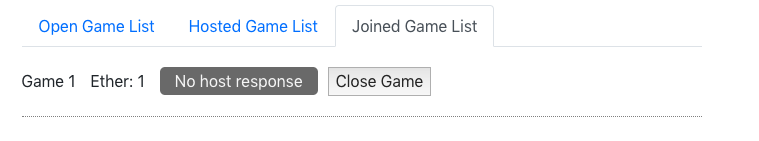
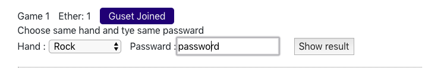
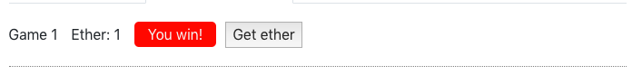
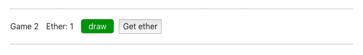
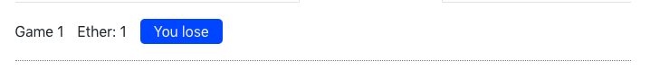

# Solidity code test

## ローカル環境でbuildする手順
Ganacheを起動しPortを`7545`に設定してください。

```
git clone 
cd solidity-code-test
npm i
truffle migrate --reset
npm run start
```

* truffleをインストールしてない方はインストールしてから始めてください。
```
npm install -g truffle@5.0.7
```

## 動作確認手順

じゃんけんゲームは下記の流れで実装しました。  
Step 1. Host Playerがゲームを作る際に、じゃんけんの手と手を秘匿化するPasswordも設定する。  
Step 2. Guest Playerがじゃんけんの手を決めてじゃんけんに参加する。  
Step 3. Host Playerがじゃんけんの手と秘匿化するPasswordを入力してじゃんけんの結果を表示する。  
Step 4. じゃんけんの結果に応じてdepositを引き出せる。  

Step2の際に、Guest Playerの手は秘匿化されすにコントラクトに書き込まれているため、Host Playerが結果を表示しないことが考えられます。  
そのため、Guest Playerがゲームに参加してから、Host Playerが1時間以内に結果を表示しなかった場合はGuest Playerが全額Depositを引き出せるようにしてます。  

下記、動作確認の手順になります。  

### 1. ゲームの作成
  
じゃんけんの手、Depositの額（単位はEther）、秘匿化するためにのするためのPasswardを設定して`Create Game`ボタンを押してください。  
じゃんけんの手、Passwardは結果を得る時に必要になるので忘れないようにメモしてください。  

  
ゲームの作成に成功すると "Hosted Game List" に作成したゲームが現れ、”Waiting guest”と表示されます。  

  
一時間経ってもGuest Playerが参加しない場合は、”No guest joined”と表示され、デポジットを引き出せるようになります。  

### 2. じゃんけんに参加する
  
Metamaskのアカウントを切り替えてリロードし、”Open Game List”からじゃんけんの手を設定してゲームに参加してください。  
ここでの”Ether: 1”は、このゲームには "1 Ether" デポジットする必要があるという意味です。  

  
ゲームに参加できたら"Hosted Game List" に作成したゲームが現れ、”Waiting host response”と出てきます。  

  
一時間経ってもHost Playerが結果を返さない場合は、”No host response”と表示され、全デポジットを引き出せるようになります。  

### 3. 結果を表示する
  
Metamaskのアカウントを切り替えてリロードし、”Hosted Game List”からじゃんけんの結果を表示してください。  
じゃんけんの手とpasswordは同じものを使用してください。  

#### 勝った場合
  
勝った場合は"You win!"と表示され”Get ether”ボタンから、相手がDepositした分のEtherを引き出すことができます。  

### 引き分けの場合
  
引き分けの場合は"Draw"と表示され”Get ether”ボタンから、Depositした額のEtherを取り出すことができます。  

### 負けた場合
  
引き分けの場合は"You lose"と表示されDepositした額のEtherは相手に渡ります。  

## コントラクトに関して
mappingを用いて複数ゲームを1つのコントラクトで管理する実装にしました。  
まずガス代削減のために1つのコントラクトで1つのゲームを繰り返し管理することを考えましたが、他の人たちのじゃんけんゲームが終わるまで他のじゃんけんを始めることができないので使いやすさにかけると考えました。  
複数のじゃんけんを管理する方法として、１つのゲームができるじゃんけんコントラクトとデプロイしてもらい、そのコントラクトアドレスを他のコントラクトで保存することも考えました。ですが、コントラクトアドレスを書き込む時にエラーが生じた場合deoisitが取り出せなくなる可能性があります。  
これらから総合的に判断して、ガス代は少し高くなりますが現在開発している実装にしました。  

## ディレクトリ構造
.<br />
│── README.md<br />
│── contracts<br />
│   │── GameContract.sol<br />
│   └── Migrations.sol<br />
│── migrations<br />
│   │── 1_initial_migration.js<br />
│   └── 2_gameContract_migration.js<br />
│── scripts<br />
│   └── seed-games.js (初期データの作成)<br />
│── src<br />
│   │── App.css<br />
│   │── App.js<br />
│   │── abis<br />
│   │   │── GameContract.json<br />
│   │   └── Migrations.json<br />
│   │── index.css<br />
│   │── index.js<br />
│   │── serviceWorker.js<br />
│   └── web3.js<br />
│── test<br />
│   └── GameContract.test.js<br />
└── truffle-config.js<br />
